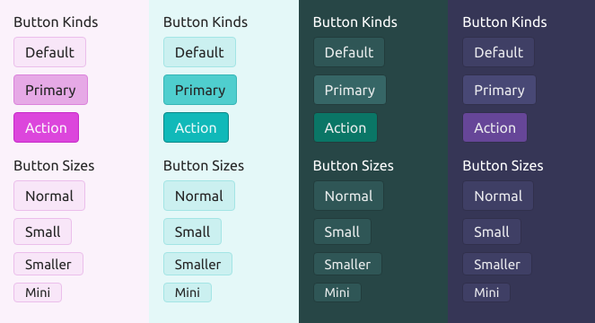

# Skyhook

A themeable UI framework created using styled-components.



* [Live Demo](./docs/storybook/index.html).

## Why another UI framework?

Existing framrworks such as Material UI, Semantic UI, and Bootstrap are designed with the
assumption that "one size fits all": that is, a single, universal "design language" will
be the best fit for every type of application. However, in practice these UI frameworks
are implicitly targeted towards a consumer audience. But there are many other audiences:

* **Artists and digital content creators** are used to working with complex, dense UIs. In addition,
  artists tools such as Maya and Blender are typically dark-themed and muted, so as to make the
  images and movies stand out better. In these apps the *media*, not the UI, is the star of the show.
* **Enterprise and professional users** also frequently work with complex UIs, particularly forms
  and tables.
* In **games and entertainment programs**, novelty often wins over consistency.
* For apps that are **tightly tied to a particular brand**, you'll want a UI that conforms to
  the design style of the brand.

The goal of Skyhook is to provide a common framework for creating your own visual design
language that suits the needs of your application. It provides a baseline set of styles which
are highly customizable, as well as all of the implementation details needed for interaction.

API-wise, the components are very similar to React-Bootstrap, although it is based on much
more recent technologies such as styled-components and React hooks. The overall organization
of the widgets is also partly inspired by Material UI and other libraries.

The framework also attempts to leverage standard HTML widgets to the maximum extent possible.
A ```<Button>``` component is just an HTML button with some styles associated with it; your event
handlers should be no different than if you were using the standard HTML widget. (This means
that you'll need to be responsible for calling ```preventDefault()``` where appropriate.)

## Theming

### Theme Factories

Skyhook provides a set of *theme factories* which can produce a theme based on a primary color
and an accent color. However, this should only be considered as a starting point; in practice,
you'll probably want to create your own theme from scratch, controlling every color precisely.

### Embedded Themeing

Skyhook also supports embedded themes: that is, you can have a side panel, dialog or embedded widget
which has a different theme than the rest of the application. This can be useful if you need
to emphasize part of the UI in some way.

### Custom Overrides

You can also create one-off widgets that have your own custom look and feel, but which inherit
most of their styles from the standard widgets. This is done via the styled-components ability
to create "derived" elements.

## Focus Tracking

Unlike some UI frameworks which hide the keyboard focus outlines (making it hard to navigate via
keyboard), Skyhook tries its best to make them look both pretty and visually consistent with the
rest of the UI. This is a benefit to both motor-impaired users and "power users".

## Future Goals

* Full ARIA support
